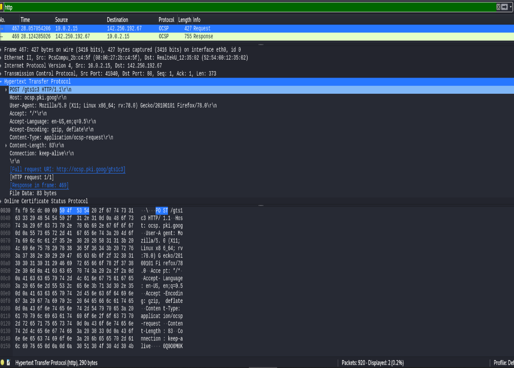
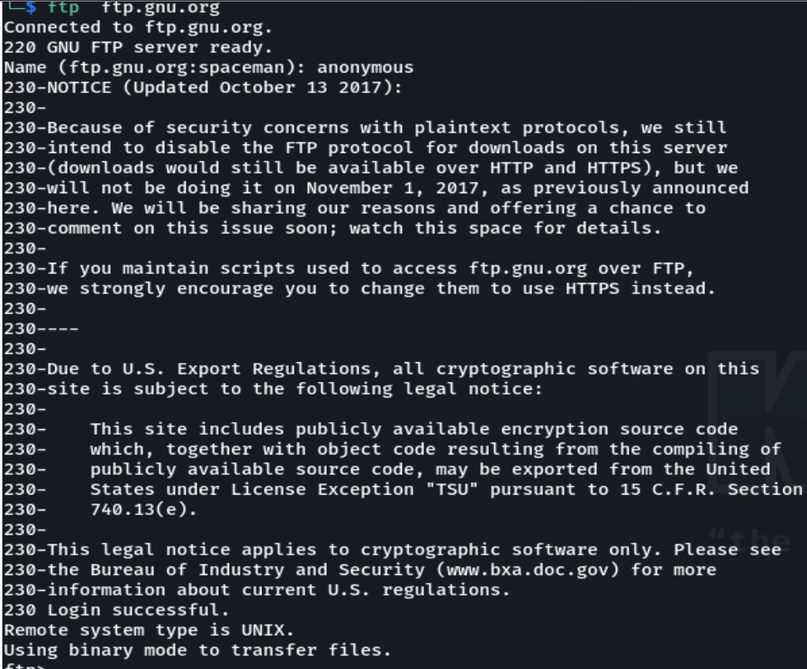
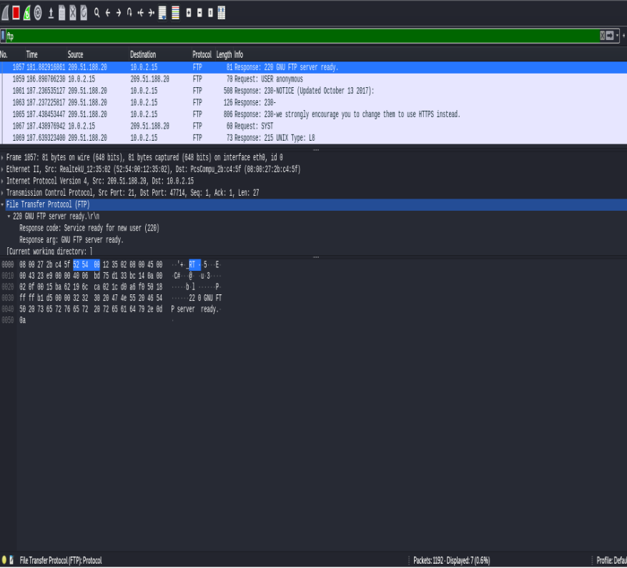
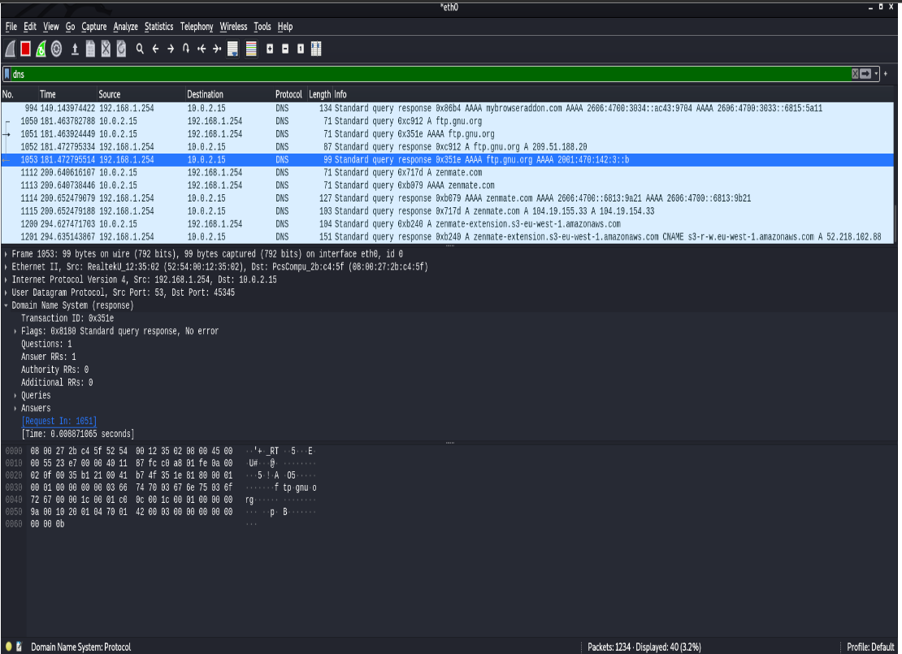

### Questions and Solutions
1. Retrieve web pages using HTTP. Use Wireshark to capture packets for analysis. Learn about most common HTTP messages. Also capture response messages andanalyse them. During the lab session, also examine and analyse some HTTP headers.

2. Use FTP to transfer some files, Use Wireshark to capture some packets.Show that FTP uses two separate connections: a control connection and a datatransferconnection. The data connection is opened and closed for each filetransfer activity. Also show that FTP is an insecure file transfer protocol becausethe transaction is done in plaintext.

3. Analyse the behaviour of the DNS protocol. In addition to Wireshark[Several network utilities are available for finding some information stored inthe DNS servers. E.g.,dig utilities (which hasreplaced nslookup). Set Wiresharkto capture the packets sent by this utility.]  
