### Questions and Solutions
1. Design  network  configuration  shown  in  Figure  4.1  for all parts. Connect all four VMs to a single Ethernet segment via a single hub as shown in Figure 4.1. Configure the IP addresses for the PCs as shown in Table 4.1.
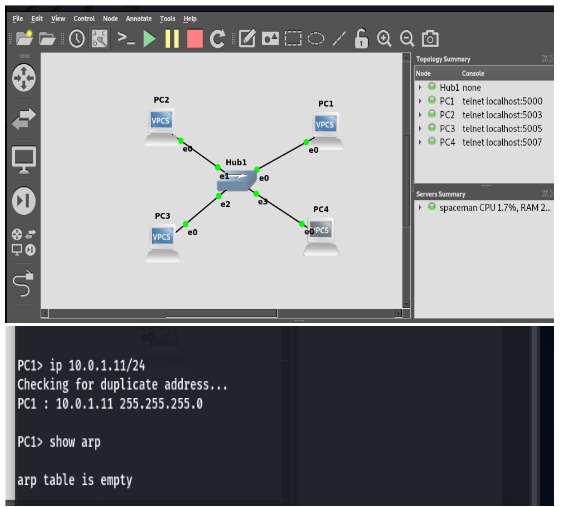
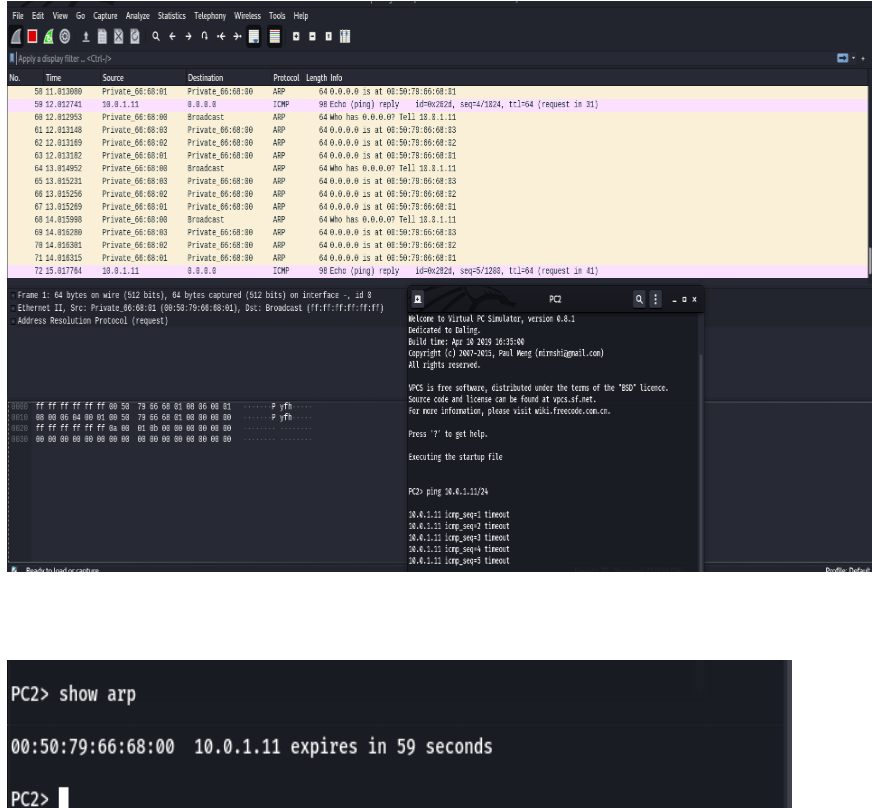
2. To  test  the  effects  of  changing  the  netmask  of  a network  configuration.  Design  the  configuration  as  Q4.1  and replace  the  hub  with  a  switch,  two  hosts  (PC2  and  PC4)  have been assigned different network prefixes. Setup the interfaces of the hosts as follows:
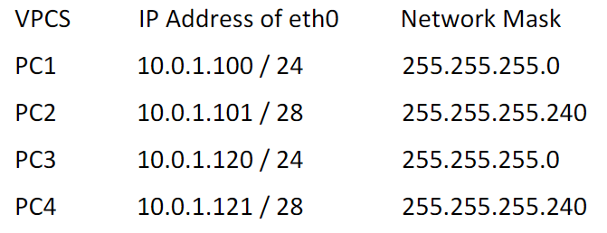
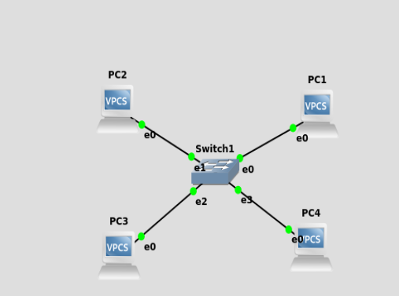
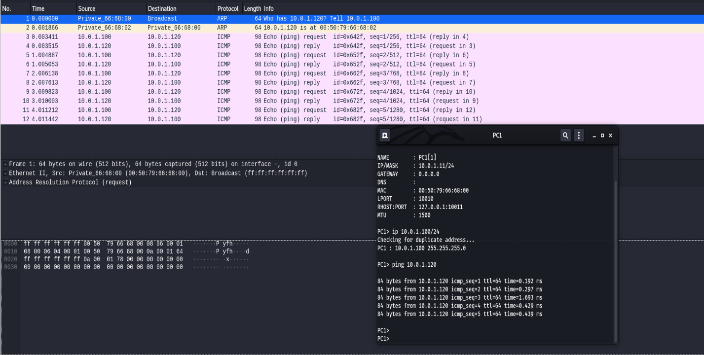
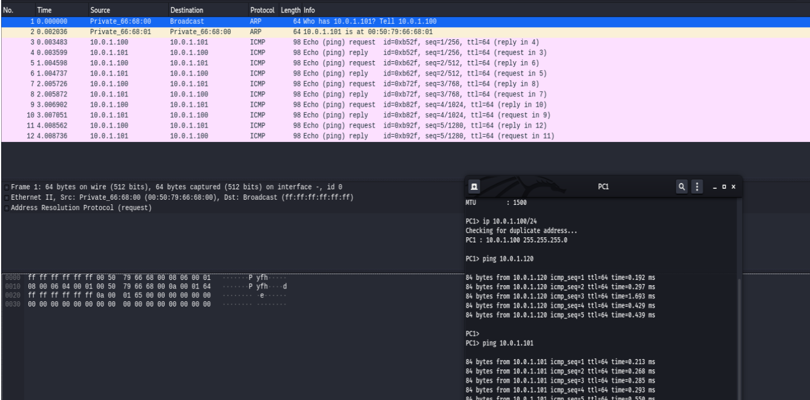
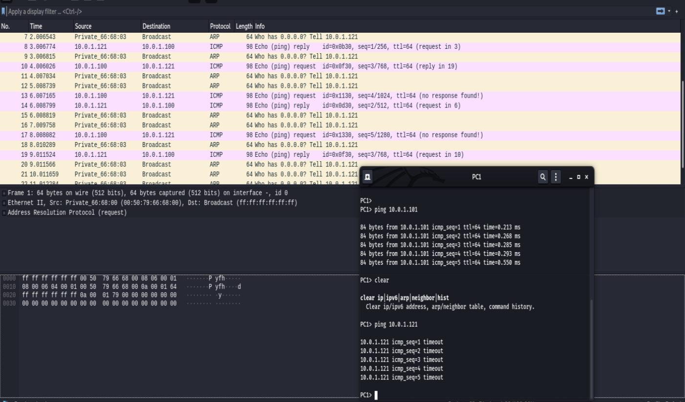
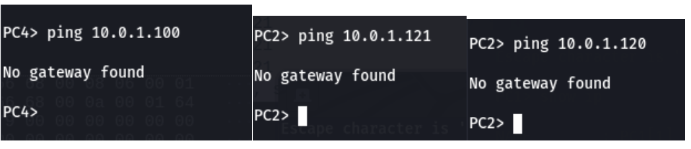
3. i.Configure  the  below  network  topologies    as  shown  in  Figures below.i. check the connectivity by pinging from PC1 toPC2.ii.     Analyse     ARP     exchanges     between     various     network components.
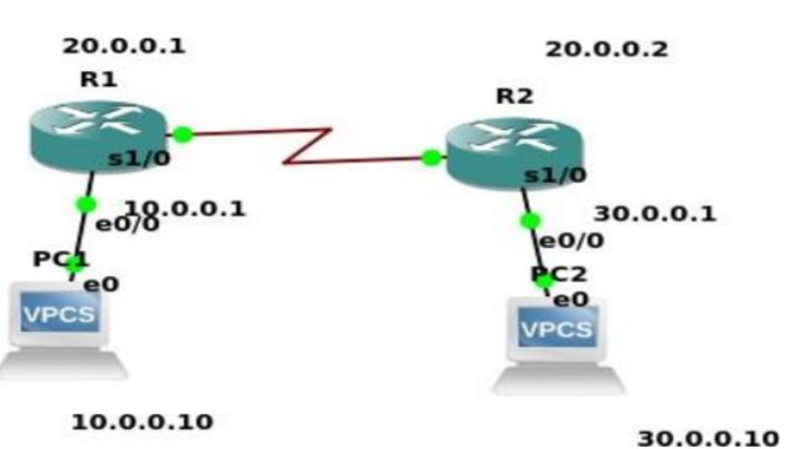
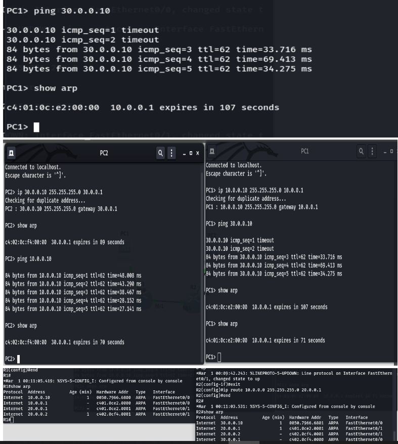
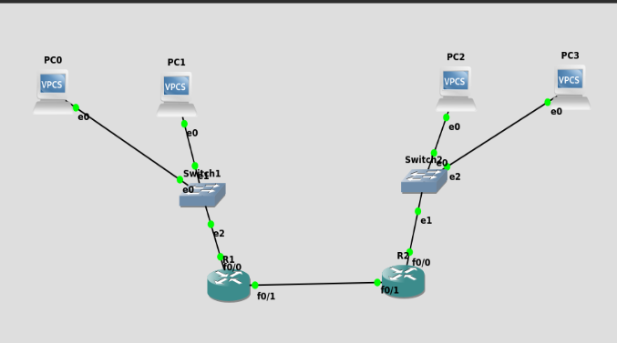
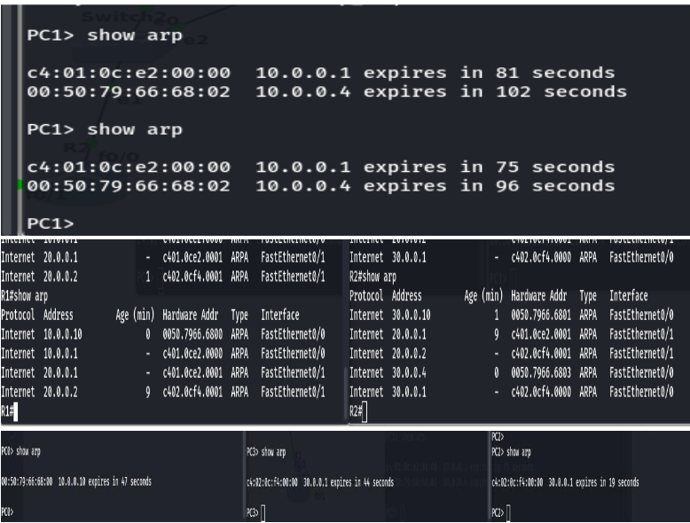